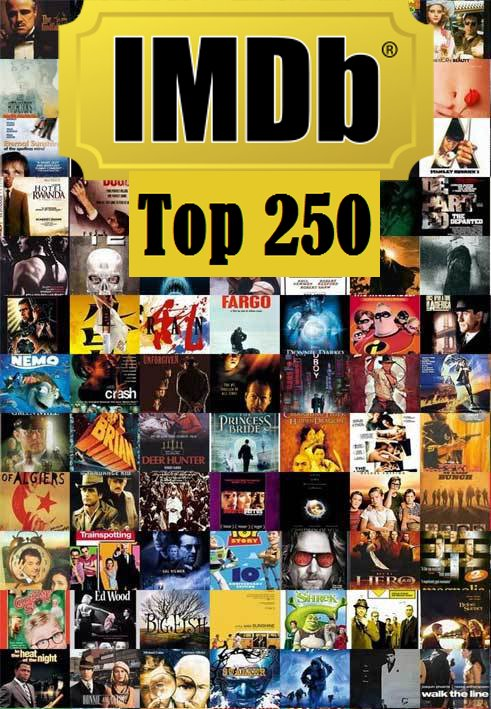

<style>
body {
text-align: justify}
</style>

```{r setup, include=TRUE}
# clear-up the environment
rm(list = ls())

# chunk options
knitr::opts_chunk$set(
  message = FALSE,
  warning = FALSE,
  fig.align = "center",
  comment = "#>"
)
```

<style>
body {
text-align: justify}
</style>

# Pendahuluan

Artikel ini dibuat untuk memenuhi tugas Learning by Building (LBB) pada materi **P4DS - Programming for Data Science**. Materi berikut ditujukan untuk semua orang yang tertarik pada bidang Data Science dan R-Language secara umum. Materi ini dipersilahkan untuk direproduksi, didistribusikan, diterjemahkan, atau diadaptasikan sesuai dengan kebutuhan pembaca. 

Penulis tertarik mengangkat topik tentang **Film** karena penulis memiliki hobi menonton Film dan TV Series di waktu senggang dan sering menggunakan Website IMdb sebagai referensi untuk mencari judul film yang menarik untuk ditonton, mencari aktor/aktris favorit penulis, dan membaca sinopsis film yang akan penulis tonton. Selain itu penulis juga mendapatkan referensi dataset yang dirasa cukup lengkap untuk diolah sehingga akhirnya penulis tertarik untuk mengolah dataset ini untuk dijadikan material tugas di **Algoritma : Data Visualization Course**. 

```{r, out.width = "60%", echo = FALSE, fig.align = "center"}

```

Artikel ini bertujuan untuk eksplorasi data dari film-film yang masuk ke dalam List Top 250 di IMDb. Susunan dari artikel ini terdiri dari metodologi untuk proses analisa data diantaranya : Seleksi Dataset, Data Cleaning dan Pre-Processing, dan Eksplorasi Data dan Pengambilan Kesimpulan. Setiap langkah dari metodologi ini akan diikuti oleh penjelasan yang dijabarkan oleh Penulis untuk memperjelas maksud dan tujuan dari setiap langkah yang dilakukan. Selain itu juga dapat bermanfaat untuk pembaca ketika ingin mencoba memulai belajar untuk mengolah sebuah dataset.

## Informasi Tentang IMDb Top 250

Dilansir dari **Wikipedia**, **IMDb** merupakan singkatan dari **Internet Movie Database** adalah sebuah basis data daring informasi yang berkaitan dengan film, acara televisi, video rumahan, dan permainan video, dan acara internet, termasuk daftar pemeran, biografi kru produksi dan personil, ringkasan alur cerita, trivia, dan ulasan serta penilaian oleh penggemar. Sebuah fitur penggemar tambahan, papan pesan, telah dinonaktifkan pada Februari 2017. Awalnya situs ini dioperasikan oleh penggemar, lalu basis data kemudian dimiliki dan dioperasikan oleh IMDB.com Inc., sebuah anak perusahaan dari Amazon.

```{r, out.width = "50%", echo = TRUE, fig.align = "center"}
knitr::include_graphics("images/IMDb-Wiki.png")
```

IMDb Top 250 adalah daftar dari 250 film berperingkat teratas, berdasarkan peringkat oleh pengguna terdaftar dari situs web menggunakan metode yang dijelaskan. Pada 7 Februari 2019, The Shawshank Redemption berada di urutan pertama dalam daftar. Peringkat **"Top 250"** hanya berdasarkan pada peringkat *"regular voters"*. Jumlah suara yang harus dilakukan oleh pengguna terdaftar untuk dianggap sebagai pengguna yang memilih secara teratur telah dirahasiakan. IMDb telah menyatakan bahwa untuk mempertahankan keefektifan daftar Top 250 mereka *"dengan sengaja tidak mengungkapkan kriteria yang digunakan seseorang untuk dihitung sebagai pemilih biasa"*. Selain bobot lainnya, 250 film Top juga didasarkan pada formula peringkat tertimbang yang disebut dalam ilmu aktuaria sebagai formula kredibilitas. Label ini muncul karena suatu statistik dianggap lebih kredibel, semakin besar jumlah informasi individu; dalam hal ini dari pengguna yang memenuhi syarat yang mengirimkan peringkat. Meskipun rumus saat ini tidak diungkapkan, IMDb awalnya menggunakan rumus berikut untuk menghitung peringkat tertimbang mereka:

```{r, out.width = "30%", echo = TRUE, fig.align = "center"}
knitr::include_graphics("images/rumus-review.png")
```

Yang dimana :

- **W** = peringkat tertimbang
- **R** = rata-rata untuk film sebagai angka dari 1 hingga 10 (rata-rata) = (Nilai).
- **v** = jumlah vote untuk film = (voting).
- **m** = suara minimum yang diperlukan untuk terdaftar di Top 250 (saat ini 25.000).
- **c** = suara rata-rata di seluruh laporan (saat ini 7,0).

Daftar Top 250 terdiri dari berbagai film fitur, termasuk rilis utama, film kultus, film independen, film yang mendapat pujian kritis, film bisu, dan film berbahasa non-Inggris. Dokumenter, film pendek, dan episode TV saat ini tidak termasuk.

## Dataset IMDb Top 250

Penulis mendapatkan datasets berbentuk *.csv* yang diambil dari **Kaggle : Data Science Comunity**. File ini terdiri dari 250 data film yang menurut user pengunggah dikumpulkan menggunakan metode webscraping di ***Bulan Juni 2022**. Untuk tiap identitas film sendiri terdiri dari nilai rating IMDb, tahun, peringkat, durasi, jumlah votes, dan lain-lain. Pada Dataset ini juga terdiri dari beberapa data pendukung pada Film seperti Genre, Penulis Naskah, Sutradara dan Aktor/Aktris yang bisa membantu untuk analisa lebih lanjut untuk pertanyaan bisnis yang lebih luas.

Sebagai catatan, IMDb Top 250 adalah list yang selalu diupdate setiap waktu sehingga ketika Penulis menganalisis dataset pada waktu ini akan berbeda dengan dataset secara real-time, ditambah selalu ada film yang diproduksi setiap waktunya dan sangat amat memungkinkan akan ada film yang keluar masuk ke dalam list ini. Maka dari itu penulis membatasi analisa list top 250 ini hanya ketika dataset ini diambil dari web.

Penulis merasa bahwa IMDb Top 250 memiliki kredibilitas review yang paling baik dibanding situs lainnya karena mencampurkan votes dari Penonton Film Biasa yang Kasual (Penonton Umum) dan Kritikus Film, walaupun mungkin tidak dijelaskan secara rinci bagaimana proporsi penilaiannya. Hal ini menurut penulis akan menyeimbangkan penilaian dari sisi hiburan dan dari sisi seni.

# Import Data dan Pre-Processing

Pada bagian ini, Penulis akan coba menjabarkan proses pengambilan data dan proses awal apa saja yang harus dilakukan agar sebuah dataset siap untuk dianalisa.

## Import Library

Penulis akan menggunakan beberapa library pada Artikel ini. Berhubung dataset dan artikel ini kemungkinan akan dikembangkan untuk Tugas LBB yang lainnya, penulis akan mengupload library yang akan digunakan pada materi selanjutnya sehingga dokumen lebih *futureproof*.

```{r}
# load library
options(scipen = 99) #me-non-aktifkan scientific annotation
library(tidyverse) #koleksi beberapa library R
library(dplyr) #grammar of data manipulation
library(readr) #membaca data
library(ggplot2) #plot statis
library(plotly) #plot interaktif
library(glue) #setting tooltip
library(scales) # mengatur skala pada plot
```


## Import dan Cek Data

Data ditaruh pada folder **data_input** pada working directory dimana file R Markdown penulis tempatkan.

```{r}
#Import Dataset
imdb_top250 <- read.csv(file = "data_input/movies-top250-imdb.csv")

#Glimpse Dataset
glimpse(imdb_top250)
```
Deskripsi Kolom :

* **'rank'** : Peringkat Film di IMDb Top 250 List
* **'id'** : ID Film
* **'name'** : Nama Film
* **'year'** : Tahun Rilis Film  
* **'imbd_votes'** : Jumlah Votes di Situs IMDb
* **'imdb_rating'** : Nilai Rating
* **'certificate'** : Sertifikasi Kategori Film
* **'duration'** : Durasi Film dalam Menit
* **'genre'** : Jenis Genre Film
* **'cast_id'**  : List ID Aktor/Aktris pada Film
* **'cast_name'** : List Nama Aktor/Aktris pada Film   
* **'director_id'**  : List ID Sutradara pada Film    
* **'director_name'** : List Nama Sutradara pada Film  
* **'writter_name'**  : List Nama Penulis Naskah pada Film 
* **'writter_id'** : List ID Penulis Naskah pada Film 

Ketika kita melihat beberapa kolom di atas, ada beberapa yang berupa list. Ini akan sedikit menyulitkan proses analisa data sehingga penulis akan mengubah beberapa Kolom untuk menjadi single data. Dimana penulis mengasumsikan bahwa data yang pertama ditulis adalah data yang utama/dominan dalam sebuah list tersebut. 

Misalnya, di Kolom Genre, nilai pertama penulis anggap sebagai Genre Utama pada sebuah Identitas Film, begitu selanjutnya nilai kedua sebagai Genre Sekunder, dan seterusnya.
Karena Penulis sudah mempelajari library **dplyr** dan merasa lebih mudah menggunakan library tersebut, penulis memilih untuk menggunakannya untuk pre-processing data di artikel ini.


```{r}
#memisahkan genre 1 2 3 dst
imdb_top250 <- separate_rows(imdb_top250, genre, sep = ",")

#menambahkan n untuk genre_n
imdb_top250 <- 
  imdb_top250 %>%
  group_by(name) %>%
  mutate(n = row_number()) %>%
  
  #pivot wider untuk genre 1 2 3, membuat kolom baru
  pivot_wider(names_from = "n", 
              names_prefix = "genre_",
              values_from = "genre")

```

Penulis juga merasa bahwa karakter utama pada Film menarik untuk dianalisa, sehingga penulis mengambil 3 karakter terdepan pada list cast_name dan mengasumsikan bahwa 3 karakter tersebut adalah karakter sentral dalam sebuah Film.

```{r}
#memisahkan cast name
imdb_top250 <- separate_rows(imdb_top250,cast_name, sep = ",")

#menambahkan n untuk cast_n
imdb_top250 <- 
  imdb_top250 %>%
  group_by(name) %>%
  mutate(n = row_number()) %>%
  
  #pivot wider untuk cast 1 2 3 dst, membuat kolom baru
  pivot_wider(names_from = "n", 
              names_prefix = "cast_",
              values_from = "cast_name") %>%
  
  #membuang kolom cast 4-dan seterusnya
  select(-(cast_4:cast_18))

```


Berdasarkan Glimpse Dataset di atas, penulis memilih untuk menjadikan beberapa Kolom sebagai *Factor* untuk mempermudah proses analisa data.
Penulis juga membuang beberapa kolom yang dianggap tidak penting lagi seperti ID, Cast ID, Director ID, dan Writer ID karena pada Dataset sudah dicombine beserta Nama Orangnya (Aktor, Aktris, Sutradara, dan Penulis Naskah)

```{r}
#cek missing value
colSums(is.na(imdb_top250))
```

Penulis melihat ada beberapa film yang memiliki missing value di genre_2 dan genre_3 diakibatkan memang beberapa film hanya memiliki 1 genre. Maka dari itu untuk kemudahan analisa penulis mengisi missing value di genre_2 dan genre_3 dengan value dari genre di atasnya.

```{r}
#transpose untuk mengubah kolom menjadi baris
imdb_top250 <-
  as.data.frame(t(imdb_top250)) %>%
  
  #fill down
  fill(1:250) 

#transpose kembali untuk mengubah baris menjadi kolom
imdb_top250 <-
  as.data.frame(t(imdb_top250))

#mengembalikan row id dengan rank menggunakan function(x)
proc.df <- function(x) {
  rownames(x) <- x[,1]
  x[,]
}

imdb_top250 <- proc.df(imdb_top250)
```

```{r}
#replace typo column
imdb_top250$imdb_votes <- imdb_top250$imbd_votes

#cleansing data
imdb_top250_clean <-
  imdb_top250 %>%
  mutate(
    certificate = as_factor(certificate),
    rank = as.integer(rank),
    duration = as.integer(duration),
    imdb_rating = as.integer(imdb_rating),
    imdb_votes = as.integer(imdb_votes),
    genre_1 = as_factor(genre_1), 
    genre_2 = as_factor(genre_2), 
    genre_3 = as_factor(genre_3),
    cast_1 = as_factor(cast_1),
    cast_2 = as_factor(cast_2),
    cast_3 = as_factor(cast_3)
  ) %>% 
  
  #drop kategori yang tidak akan digunakan
  select(-c(id, cast_id, director_id, writter_id,imbd_votes))
  
glimpse(imdb_top250_clean)
```
```{r}
#cek ukuran data
nrow(imdb_top250_clean)
```


# Eksplorasi Data

Pada artikel ini, penulis tertarik untuk mengajukan beberapa pertanyaan untuk Dataset yang telah dibuat. Diantaranya :

**Pertanyaan Kategorikal**

- 1. Film pada Tahun berapa atau periode Tahun berapa yang paling banyak berada di IMDb Top 250?
- 2. Genre Film apa saja yang paling sering masuk ke dalam IMDb Top 250?
- 3. Siapa saja Aktor/Aktris Utama yang paling sering masuk ke dalam film IMDb Top 250?
- 4. Siapa saja Sutradara yang paling sering membuat film yang masuk ke dalam IMDb Top 250?

**Pertanyaan Numerikal**

- 5. Bagaimana durasi dan nilai review film yang ada di dalam IMDb Top 250?
- 6. Bagaimana hubungan votes dan nilai review di IMDb Top 250?

## Periode Tahun Film paling sering muncul di IMDb Top 250

Berdasarkan Pertanyaan 1. metodologi sebagai berikut : Pengelompokan Data berdasarkan **'Year'**, disimpulkan dengan membuat kolom baru yang mengandung frekuensi **'Year'** muncul pada dataset. Lalu diarrange berdasarkan **'Year'** yang paling sering muncul, diambil 10 data paling atas.

```{r}
imdb_top_year <-
  imdb_top250_clean %>%
  group_by(year) %>%
  summarise(count_year = n()) %>%
  ungroup() %>%
  arrange(desc(count_year)) %>%
  head(10)
imdb_top_year
```

## Genre Film paling sering muncul di IMDb Top 250

Berdasarkan Pertanyaan 2. metodologi sebagai berikut : Pembuatan Kolom baru berdasarkan value genre_1 sampai dengan genre_3, lalu Pengelompokan Data berdasarkan **'Genre'**, disimpulkan dengan membuat kolom baru yang mengandung frekuensi **'Genre'** muncul pada dataset. Lalu diarrange berdasarkan **'Genre'** yang paling sering muncul, diambil 10 data paling atas.


```{r}
imdb_top_genre <-
  imdb_top250_clean %>%
  pivot_longer(cols=c('genre_1', 'genre_2', 'genre_3'),
               names_to = 'level_genre',
               values_to = 'genre') %>%
  group_by(genre) %>%
  summarise(count_genre = n()) %>%
  ungroup() %>%
  arrange(desc(count_genre)) %>%
  head(10)

imdb_top_genre
```

## Aktor/Aktris yang paling sering muncul sebagai Tokoh Utama/Tokoh Sentral di IMDb Top 250

Apabila kita lihat di website IMDb, penulisan karakter pada umumnya dituliskan berdasarkan urutan peran paling utama ke yang paling figuran. Sehingga asumsi pertama mengambil 3 karakter pertama pada **'Cast'** bisa kita pakai.

Contoh, Film Se7en :
```{r, out.width = "100%", echo = TRUE, fig.align = "center"}
knitr::include_graphics("images/imdb-se7en.png")
```


```{r}
imdb_top250_clean[imdb_top250_clean$name == "Se7en",c("cast_1","cast_2","cast_3")]
```
Berdasarkan Pertanyaan 3. metodologi sebagai berikut : Pembuatan Kolom baru berdasarkan value cast_1 sampai dengan cast_3, lalu Pengelompokan Data berdasarkan **'Cast'**, disimpulkan dengan membuat kolom baru yang mengandung frekuensi **'Cast'** muncul pada dataset. Lalu diarrange berdasarkan **'Cast'** yang paling sering muncul, diambil 10 data paling atas.

```{r}
imdb_top_cast <-
  imdb_top250_clean %>%
  pivot_longer(cols=c('cast_1', 'cast_2', 'cast_3'),
               names_to = 'order_cast',
               values_to = 'cast') %>%
  group_by(cast) %>%
  summarise(count_cast = n()) %>%
  ungroup() %>%
  arrange(desc(count_cast)) %>%
  head(10)

imdb_top_cast
```

## Sutradara yang karyanya paling sering muncul di IMDb Top 250

Berdasarkan Pertanyaan 4. metodologi sebagai berikut : Pengelompokan Data berdasarkan **'Director'**, disimpulkan dengan membuat kolom baru yang mengandung frekuensi **'Director'** muncul pada dataset. Lalu diarrange berdasarkan **'Director'** yang paling sering muncul, diambil 10 data paling atas.

```{r}
imdb_top_director <-
  imdb_top250_clean %>%
  group_by(director_name) %>%
  summarise(count_director_name = n()) %>%
  ungroup() %>%
  arrange(desc(count_director_name)) %>%
  head(10)
imdb_top_director
```

## Durasi dan Review pada Film-Film di Top 250 IMDb

Penulis akan coba menganalisa data **'Durasi'** dan **'Nilai Review'** menggunakan fungsi summary() dan diagram BoxPlot

```{r}
summary(imdb_top250_clean)
```
```{r}
boxplot(imdb_top250_clean$duration)
```
```{r}
boxplot(imdb_top250_clean$imdb_rating)
```


```{r}
# scatter plot
# memeriksa hubungan nilai rating dengan jumlah votes

rating <- imdb_top250_clean$imdb_rating
votes <- imdb_top250_clean$imdb_votes

plot(rating, votes)
abline(lm(rating ~ votes), # garis linear `lm` 
       col = 'red') # warna garis
```

## Konklusi Data Analisis Numerik

Berdasarkan data di atas, penulis dapat mengambil beberapa *insight* sebagai berikut :

* Sebaran Durasi pada film di IMDb Top 250 berada paling banyak di 100-150 menit
* Nilai Review tersebar banyak di kisaran nilai 8.0, sangat jarang film yang bisa mendapat nilai 9.0 dari review
* Jumlah Votes tidak berkaitan/berkorelasi dengan Nilai Votes, sehingga kredibilitas Nilai Review dapat dijamin. Hal ini terlihat dari garis regresi linear yang berupa hampir garis lurus.

# Referensi 

1. [IMDb : Internet Movie Database](https://id.wikipedia.org/wiki/Internet_Movie_Database)
2. [Kaggle Dataset : IMDb Top 250 Movies](https://www.kaggle.com/datasets/ashishjangra27/imdb-top-250-movies)
3. [IMDb : Top 250 List](https://www.imdb.com/chart/top)
